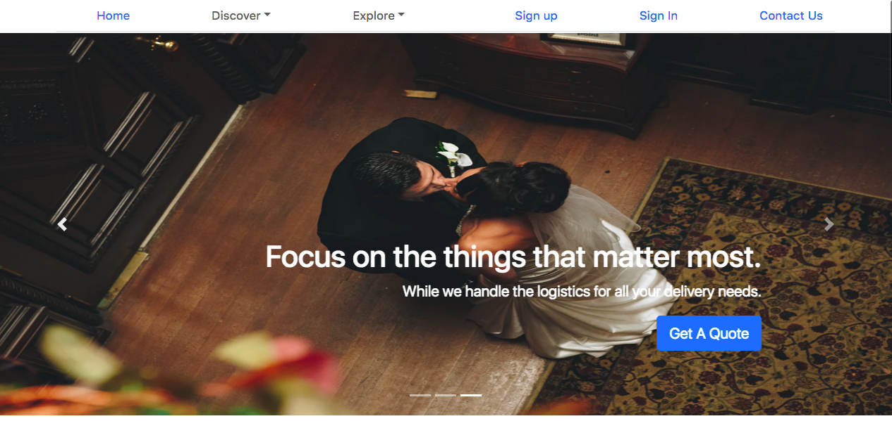
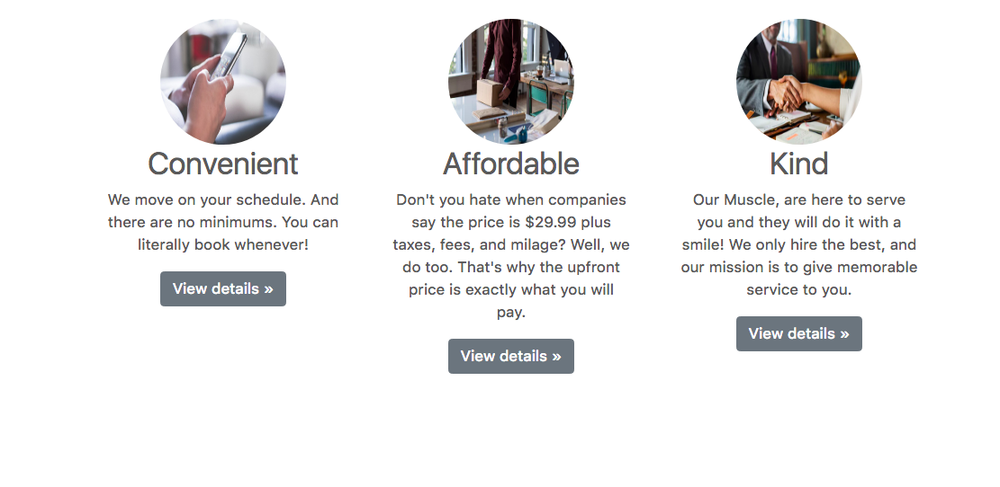
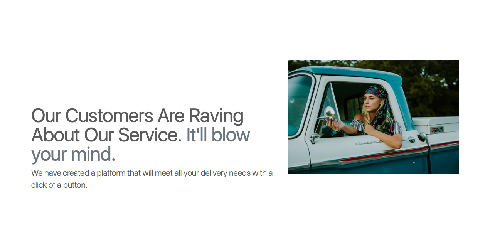
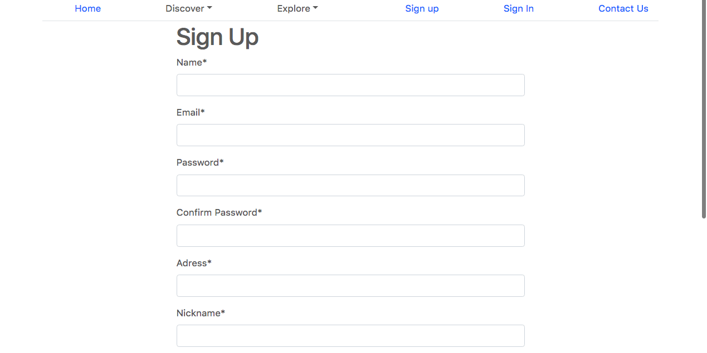
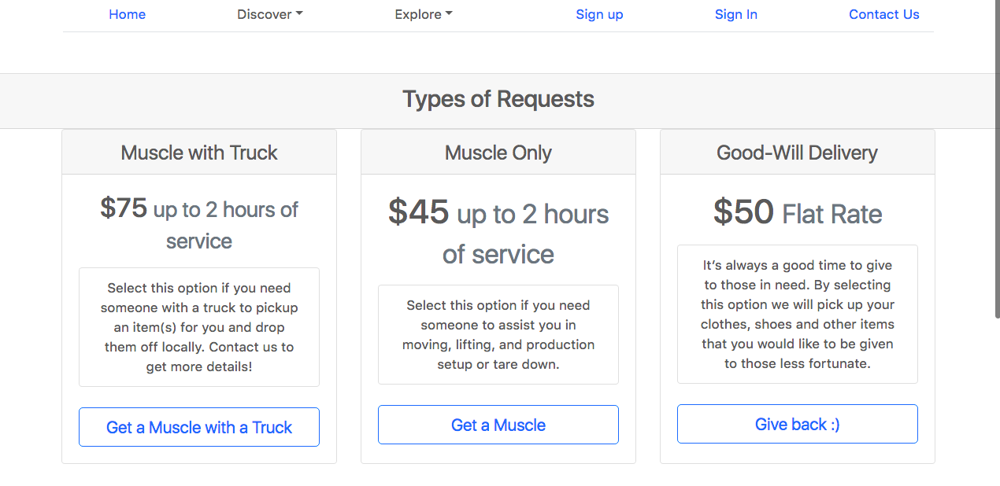

# delivr2U

### Overview

delivr2U is an On-Demand app that allows you to request a mover or muscle with a click of a button!
###An introduction to the application
 
 - delivr2U is an on demand delivery app. 
      
 - The app intends to solve the problems that customers have with getting a mover/muscle at anytime and with a flat rate.

---

### Installation/Startup Instructions

* The first step is to download this directory from Github to a local directory on your computer.

* Open Terminal 

* Open the project directory and type: bundle install

* Make sure you have Postgres, if not download from the Postgres website. 

* Then, start a Postgres local server

* Open a new terminal tab and make sure you are not in Postgres or have a rails server open in that tab.

* Type: rails run db:migrate 
    -(this will migrate the app's tables)

* Type: rails server. 
    -(This will start your server)

* Open a new tab on your browser and type in localhost:3000
    -(If you get an error or a different application, make sure you do not have a previous local server running in a separate terminal tab.)

* Start using the app to find a "Muscle/Mover" in your area!

---

### Technologies Used
1) Ruby on Rails
Ruby is very straight forward and easy to navigate. I found the helper property to work well for the type of app that I have built.

2) Postgresql
Postgresql was the platform used to create the databases that stores the clients details. It was also very simple to use.

3) Bcrypt
Bcrypt is the gem I used to secure the customer's information. Using this gem is crucial to protecting the customers details especially their password!

4) Bootstrap
I love Bootstrap because it helps us create eloquent designs  and saves us a great deal of time.

5) HTML
HTML is the structure of the files used to render the site.

6) CSS
CSS is the platform used to style the app beautifully!

**Check it out...**
 - A link to my **tello board and user stories:** 
    https://trello.com/b/1OA98kgX
    
- The delivr2U app is deployed on Heroku: **https://guarded-basin-14232.herokuapp.com/** 

- View more through my **git repository for the app, hosted on GitHub** 
https://github.com/keabutler1/delivr2U.git
___

### Explanation
**2 models were used** 
the **users and thier requests**. 
 **A sign up/log in functionality was implemented**, For instance if a user was not logged in they could not make a request for a delivery. When they were logged in they could do everything else except of course signup with the same credentials.
**Full CRUD** was used for the Requests model. Users are able to Get, Post, Patch/Put, and delete their Requests.
I left the  HTML and CSS very sleek and simple so the user experience would be easy going.

___

### Backlog

I think I did a good job with coming up with the concept and design. In the future I would like to add links in the footer, allow the customer to upload images, and implement social media links. The major problem I faced with this app was mainly getting the routes accurate. Also, I really enjoyed doing the app I just have to balance a little better because I tend to try to do too much at once.  
___

### Resources

* Uplash

* My Awesome GA Instructors & classmates

* Stack Overflow

* W3 Schools 

* Google
